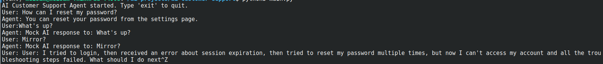
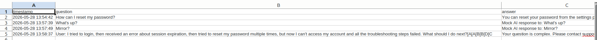

# AI Customer Support Agent with Python

A Python automation project that provides customer support via AI logic. The agent can answer FAQ questions, refer complex questions to a human, and save all conversations for review.

---

## Features

- Answer questions from FAQ
- Refer complex questions to human support
- Save all conversations in CSV
- Error handling
- Automation workflow

---

## Technologies Used

- Python
- Pandas
- python-dotenv
- OpenAI Mock AI logic
- Git & GitHub

---

## Project Structure

```text
ai-customer-support/
├── data/
│   └── faq.csv
├── logs/
│   └── conversations.csv
├── screenshots/
│   ├── program-run.png
│   └── conversations-log.png
├── main.py
├── requirements.txt
├── README.md
├── .env
└── .gitignore
```

---

## Installation

Clone the repository:

```bash
git clone https://github.com/najafi81/ai-customer-support.git
```

Go to project directory:

```bash
cd ai-customer-support
```

Create virtual environment:

```bash
python3 -m venv venv
```

Activate virtual environment:

### Linux / macOS

```bash
source venv/bin/activate
```

Install dependencies:

```bash
pip install -r requirements.txt
```

---

## Input FAQ CSV

Place FAQ CSV in:

```text
data/faq.csv
```

Columns:

| question | response |
|---|---|

---

## Environment Variables

Create `.env` file:

```env
OPENAI_API_KEY=your_openai_api_key
```
> Currently using mock AI for demonstration; no API calls needed.

---

## Usage

Run the program:

```bash
python3 main.py
```

- Type your question at the prompt
- Type `exit` to quit
- The agent will answer using FAQ or Mock AI logic
- Complex questions are referred to human support

---

## Output CSV

All conversations are saved in:

```text
logs/conversations.csv
```

Columns:

| timestamp | question | answer |
|---|---|---|

---

## Screenshots

### Program Execution



### Conversation Log



---

## Security Notes

Do not upload `.env` or temporary files to GitHub:

```text
.env
venv/
__pycache__/
*.docx
```

---

## Future Improvements

- Real OpenAI API integration
- More advanced NLP logic
- Chat UI
- CRM integration
- Multi-language support

---

## Author

Meisam

GitHub:
https://github.com/najafi81
